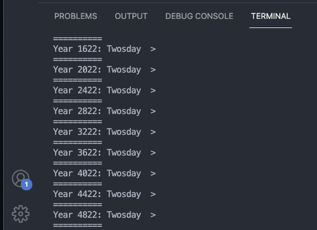

# twosday calculator

## a simple computation algorithm to find if there is a twosday (2/22/22) in a given year.

### main.py is just an example on how to run the file twosday.py which contains the alg itself. 

